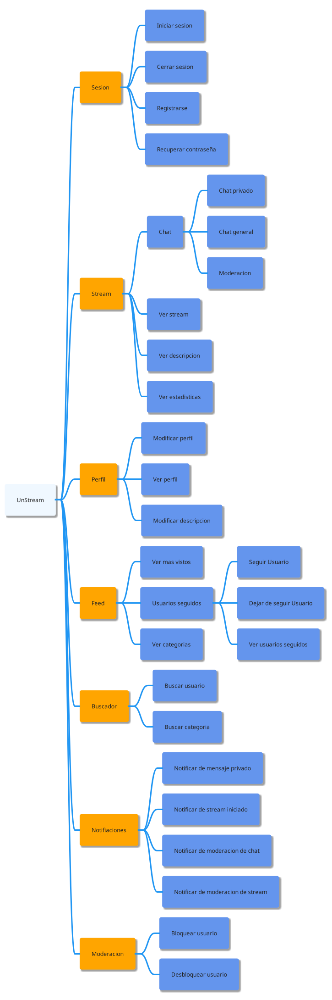
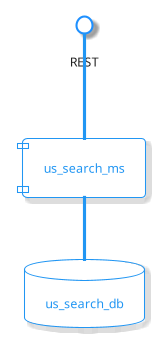
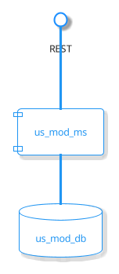
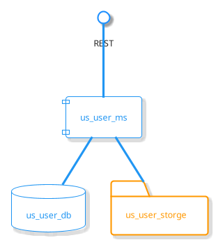
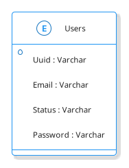
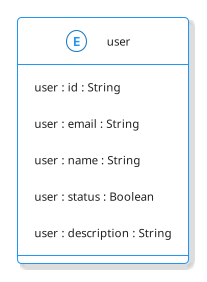
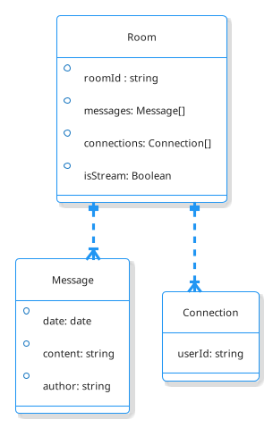

<center></center>

# <center>swarch_p2_1c</center>


## 1. Introducción
### 1.1. Equipo
#### 1.1.1. Nombre

Equipo 1C

#### 1.1.2. Integrantes

- Andrés Camilo Correa Romero
- Jorge Camilo Colmenares Santos
- Cristian Fernando Santos Ribero
- Nicolás Leonardo Niño Sierra
- Mario Aníbal Bohórquez Mora
- Diego Alejandro Alvarado Chaparro

### 1.2. Sistema de Software

#### 1.2.1. Nombre

**UNStream**

#### 1.2.2. Logo

<!--  -->


#### 1.2.3. Descripción

**UNStream** es una plataforma de live streaming, donde todos los usuarios pueden publicar y consumir videos en vivo, con funciones de chat en tiempo real, búsqueda por categorías, moderación, subscripciones y notificaciones.

## 2. Vistas Arquitectónicas

### 2.1. Vista de Descomposición

#### 2.1.1. Representación Gráfica

<!--  -->


#### 2.1.2. Descripción de la Vista

El sistema estará compuesto de 7 módulos principales:

- **Sesión:** Este módulo se encargará de manejar toda la información relacionada con la sesión del usuario. Por medio de este módulo el usuario podrá iniciar y cerrar sesión, registrarse y recuperar su contraseña.
- **Stream:** En este módulo se manejarán todas las funcionalidades relacionadas con el live stream. Los usuarios con diferentes roles podrán tanto ver, como publicar un stream, participar en el chat público (chat de stream donde habrá moderación de contenido por parte de otros usuarios elegidos) y en el privado (chat entre dos usuarios) y visualizar la cantidad de personas conectadas al stream.
- **Perfil:** Este módulo permitirá al usuario manipular y visualizar la información relacionada con su perfil.
- **Feed:** Este módulo proporcionará una vista de los streams disponibles y recomendados, organizados por categorías, seguidos y más vistos.
- **Buscador:** En este módulo se implementarán una barra de búsqueda, dado una palabra clave proporcionada por el usuario se devuelven streams con la categoría o usuario más cercano.
- **Notificaciones:** Este módulo permitirá la notificación de eventos al usuario ya sean eventos de moderación, stream o mensajes.
- **Moderación:** Este módulo genera herramientas para que los usuarios moderadores puedan administrar reportes, bloqueando y desbloqueando usuarios.

### 2.2. Vista de Componentes y Conectores (C&C)

#### 2.2.1. Representación Gráfica


#### 2.2.2. Descripción de la Vista

##### 2.2.2.1. us_stream

En este componente se implementarán las funcionalidades de crear un stream, verificar la key de stream de usuario, proporcionar estadísticas y notificar el inicio de un stream.


Como se puede observar, se expone una interfaz por medio del protocolo [RTMP](https://rtmp.veriskope.com/docs/) para el redireccionamiento, codificación, verificación y demás procesos del stream entrante.

También se expone una interfaz con el protocolo [HLS](https://developer.apple.com/streaming/) para realizar la transmisión de los paquetes codificados de video a los espectadores.

En este componente se utiliza una base de datos no relacional en *__Firestore__* junto con un microservicio en __*JavaScript*__ en el framework __*ExpressJS*__ para la autenticación del usuario. Para la redirección y codificación de paquetes del protocolo RTMP se utiliza __*Ngnix*__. Finalmente para la para exponer los fragmentos de video se utilizara un microservicio en el lenguaje __*JavaScript*__ en el que también se expondrán estadísticas y notificaciones por medio de __**REST**__ con una base de datos en NoSQL __**Redis**__.

##### 2.2.2.2. us_search

En este componente se implementarán una barra de búsqueda, dado un término por el usuario se devuelven términos compatibles con su búsqueda en este caso se devuelven posibles nombres de usuarios.



Como se puede observar, se expone una interfaz por medio del protocolo REST por el cual se llegan las peticiones HTTP las cuales son procesadas por el microservicio, el cual hará las querys pertinentes en la base datos respectiva para devolver los resultados compatibles con la búsqueda. 

##### 2.2.2.4. us_session

En este componente se implementarán las funcionalidades asociadas a crear e iniciar una sesión dentro de la aplicación, Entre ellos la creación y validación de toques de usuario.


Como se puede observar, se expone una interfaz por medio del protocolo REST por el cual se llegan las peticiones HTTP las cuales son procesadas por el módulo main, el módulo account se encarga de conectarse con la base de datos, y el módulo JWT se encarga de proveer las funcionalidades de generar y validar las tokens.

En este componente se utiliza una base de datos relacional en *__Postgres__* junto con un microservicio en __*Go*__ en el framework __*GorillaMUX*__ para la autenticación del usuario.

##### 2.2.2.5. us_mod

En este componente se implementarán las acciones de moderación para registrar reportes, usando C# con .NET y ASP.NET y Firebase para la base datos NoSQL.



##### 2.2.2.6. us_user

El microservicio de us_user_ms es el encargado de guardar toda la información personal del usuario que se registre en la plataforma UNSTREAM.



Respecto al diagrama de componentes anterior, el microservicio se realizó con el lenguaje de programación Python con el framework Django, respecto a la base de datos se usó Postgres SQL, el micro servicio va conectado a la API REST.

##### 2.2.2.6. us_chat

El microservicio de us_streamchat_ms es el encargado de manejar el chat de cada uno de los streams como también los chats entre usuarios, haciendo uso de *rooms* o cuartos de chat.


El componente us_streamchat_ms está desarrollado utilizando **TypeScript** haciendo uso principalmente de la librería **mongoose**. En tanto al componente de base de datos, us_streamchat_db hace uso de la base de datos **MongoDB**


### 2.3.  Vista de Modelo de Datos

#### 2.3.1 us_stream
##### 2.3.1.1 us_rtmpauth_db
###### Nomenclatura 
|icono|elementó|
|---|---|
|📖| Colección |
|📄| Documento |
|*| Atributo |

###### Vista 
```
 📖 Keys
     📄 {user_uid}
        * stream_key (String)
```
###### Descripcion 
Ya que en principio solo se necesita verificar que la key proporcionada por el streamer sea correcta, el único dato almacenado será esta key, dentro del documento con la misma *uid* que el usuario.
##### 2.3.1.2 us_hlscache_db

###### Vista 
```
{uid}:view - value
{uid}:state - value

```
###### Descripcion 
Ya que cada stream está relacionado con la uid de cada usuario solo es necesario utilizar esto como key para acceder al valor del estado y la cantidad de vistas del stream.
#### 2.3.2 us_search
##### 2.3.2.1 us_search_db

###### Nomenclatura 
|icono|elementó|
|---|---|
|📖| Colección |
|📄| Documento |
|*| Atributo |

###### Vista 
```
 📖 Users
     📄 {doc_id}
        * SearchTemps (String[])
        * UserName (String)
```
###### Descripcion 
Para realizar las funcionalidades del microservicio de buscador solo es necesaria una colección en firebase que albergue su nombre y un array de las posibles búsquedas asociadas.

#### 2.3.3 us_session
##### 2.3.3.1 us_session_db

###### Vista 

###### Descripcion 
Para realizar las funcionalidades del microservicio de sesión solo es necesaria una tabla que albergue la información relévate del usuario para este proceso. Su email, su estado de moderación, y su contraseña.
#### 2.3.4 us_mod
##### 2.3.4.1 us_mod_db
###### Nomenclatura 
|icono|elementó|
|---|---|
|📖| Colección |
|📄| Documento |
|*| Atributo |

###### Vista 
```
 📖 reports
     📄 {doc_id}
        * reporter 
        * cause 
        * status 
        * idMessage 
        * idStream 
        * assignedModerator 
```
#### 2.3.5 us_user
##### 2.3.5.1 us_user_db
###### Vista 

###### Descripcion 
Este es el modelo de datos del micro servicio us_user_ms donde el campo id es un campo de tipo string el cual guarda un ID único que recibe desde el micro servicio us_sesion_ms, el campo email guarda el email del usuario, este campo es de tipo string y es único, el campo name es el campo del nombre del usuario original, el campo status es de tipo booleano e indica si el usuario está eliminado baneado o no de la base de datos y el campo description que indica la descripción del usuario.
#### 2.3.6 us_chat
##### 2.3.6.1 us_chat_db
###### Vista 


### 2.2 Vista por capas
#### 2.2.1. Representación Gráfica

<!--  -->
<!--  -->

#### 2.2.2. Descripción de la Vista

El sistema se divide en tres capas físicas: la de interfaz, la capa de lógica y la capa de datos

##### Interfaz
En esta capa encontramos los componentes que tendrán comunicación con el cliente, como lo es el API Gateway, que tendrá comunicación con el cliente por medio de REST; también se encuentran las colas de mensajes, en tanto al chat, los clientes podrán conectarse para obtener los mensajes de los grupos a los que hacen parte y tener comunicación en vivo con las salas de chat, en tanto a la cola de notificaciones, en esta los clientes se suscribirán para recibir las notificaciones de manera rápida sin tener que realizar una petición HTTP.

##### Lógica
Aquí conviven todos los microservicios y su comunicación con la capa de datos y la capa de interfaz. Contienne la lógica de negocio.

##### Datos

Los diferentes microservicios guardarán la información persistente en distintas bases de datos, tales como bases de datos relacionales, noSQL, como también servicios de storage